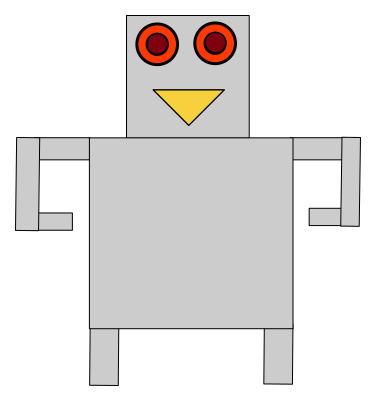

## Objective

A very simple project that shows CDI in action on servlets.
Void of anything else but at least including SessionScoped.

## See it in action

The bean [Hello](src/main/java/de/iubh/webanwendungen/Hello.java) says hello
and is RequestScoped: It is created before and erased after each
request. It greets the user by name that was input. 
The RequestScoped makes it that for every new tab opened, 
the name is empty and only filled by a form submission (return key).

The bean has a [FriendsMemory](src/main/java/de/iubh/webanwendungen/FriendsMemory.java) field which remembers when it greeted
which name with which browser. This memory is rendered everytime
the browser visits and is specific to each browser, being associated
with the science.

## Log

- Works with versions faces:2.3.16, weld-servlet-shaded:3.0.0.Final
  
- CDI (@Named and friends) with faces:4.0.0-M1  and weld-servlet-core:4.0.2-Final